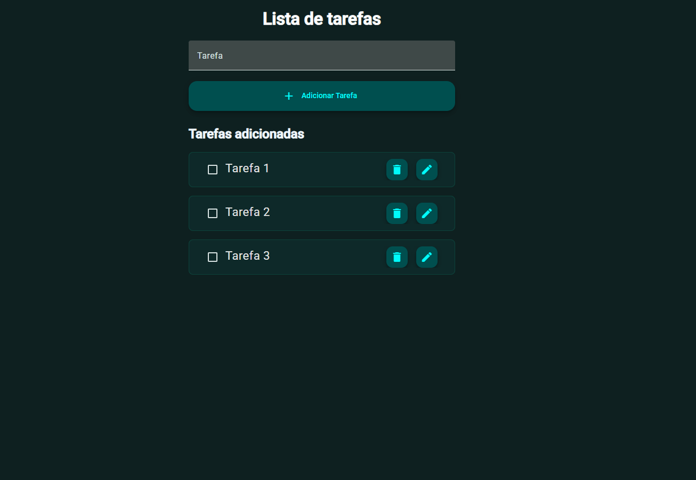

# 📝 Lista de Tarefas com Angular

Desafio 1/10

Este é um aplicativo simples de lista de tarefas (To-do list) criado com **Angular** e **Angular Material**, onde o usuário pode adicionar, remover, editar e marcar tarefas como concluídas. As tarefas são armazenadas no `localStorage` para persistência entre sessões.

## 🚀 Funcionalidades

- ✅ Adicionar novas tarefas
- 🗑️ Remover tarefas
- ✏️ Editar tarefas
- ✔️ Marcar tarefas como concluídas
- 💾 Salvamento automático no `localStorage`

## 📦 Tecnologias usadas

- [Angular](https://angular.io/)
- [Angular Material](https://material.angular.io/)
- TypeScript
- HTML / CSS

## 🧑‍💻 Instalação

1. Clone o repositório:

```bash
git clone https://github.com/Tiesco789/todo-list.git
cd todo-list
```

2. Instale as dependências:
```bash
npm install
```
3. Rode o servidor de desenvolvimento:

```bash
ng serve
```

4. Acesse em `http://localhost:4200`

## 📁 Estrutura
`src/app/input-todo/input-todo.component.ts` – Componente principal com a lógica de tarefas.

`src/app/input-todo/input-todo.component.html` – Template com o formulário e a lista de tarefas.

`src/app/input-todo/input-todo.component.css` – Estilos da lista de tarefas.

📸 Prévia


## 🧙‍♂️ Autor
Feito com 💙 por Franccesco Bordon
